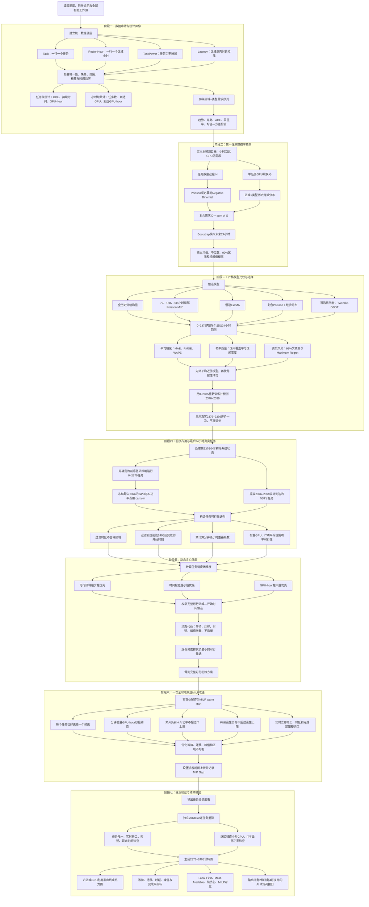

# 问题一整体技术路径

## 1. 目标与基本原则

问题一包含三个彼此衔接但输入口径不同的子问题：

1. 对第 0–2399 小时的真实 AI 任务进行统计分析；
2. 仅使用第 0–2375 小时以前的信息，预测第 2376–2399 小时的区域—任务类型 GPU 需求，并用已给出的真实值评价预测精度；
3. 使用第 2376–2399 小时实际到达的逐任务数据建立基础算力调度方案，允许任务在第 2400–2405 小时结清，但不得占用第 2406 小时。

本方案遵循以下第一性原理：

- GPU 总需求来源于“到达了多少任务”和“每个任务需要多少 GPU”；
- 预测模型的复杂度必须由真实时序信号和滚动回测增益支持；
- 调度首先满足物理约束和服务约束，再优化等待、迁移和负载分布；
- 任务的分钟级持续时间必须通过实际小时重叠比例计算，不能粗暴整小时化；
- 预测结果只用于精度评价和容量风险解释，不代替实际任务进入最终调度；
- 所有结果由独立验证程序从导出表重新计算，不能只相信求解器内部汇总值。

## 2. 总体流程

## 3. 数据底座与审计结果

### 3.1 核心中间表

建议只维护以下四张标准表：

1. `Task`：任务编号、类型、到达小时、GPU需求、持续分钟、来源区域、最大时延、最晚完成时间；
2. `RegionHour`：区域、小时、非AI负荷及与后续问题共享的逐时电力参数；
3. `TaskPower`：任务类型到每等效GPU功率的官方映射；
4. `Latency`：来源区域到执行区域的单向时延。

### 3.2 已确认的数据事实

- `workload_trace.xlsx` 共 50,000 条任务；
- TaskID 无重复，所有核心字段无缺失；
- 到达时间范围为 0–2399；
- GPU需求范围为 1–127；
- 持续时间范围为 10–399 分钟；
- 所有 `EarliestStartHour` 均等于 `ArrivalHour`；
- 所有任务均为 `NonPreemptive`；
- 第 2376–2399 小时共有 538 个实际到达任务；
- `region_time_data.xlsx` 实际覆盖 0–2406，每个区域均有 2407 行；
- GPU、IT功率、设施功率和网络时延均必须进入问题一调度约束。

## 4. 统计分析

### 4.1 主要统计量

对区域 `r`、类型 `k`、小时 `t` 定义：

#### 到达任务数量

$$
N_{rkt}=\sum_i \mathbf{1}(a_i=t,\,o_i=r,\,k_i=k).
$$

#### 到达GPU需求

$$
D_{rkt}=\sum_i g_i\mathbf{1}(a_i=t,\,o_i=r,\,k_i=k).
$$

#### 到达GPU-hour工作量

$$
W_{rkt}=\sum_i g_i\frac{d_i}{60}\mathbf{1}(a_i=t,\,o_i=r,\,k_i=k).
$$

其中，`D` 是主预测目标，`W` 是容量压力辅助指标。

### 4.2 必做统计检验

- 各区域、各类型任务数量与占比；
- GPU需求、持续时间、GPU-hour的均值、中位数、P90、P95、最大值；
- 小时序列的均值、标准差、零值率、峰均比；
- 滞后1、24、168小时自相关；
- 日内24小时均值差异；
- 任务数量的均值—方差关系；
- Poisson理论零概率与实际零比例；
- 如存在显著过度离散，再比较Negative Binomial；
- 只有实际零比例显著超过Poisson理论值时，才考虑Zero-Inflated模型。

## 5. 第一性原理预测模型

### 5.1 生成机制

每个区域—类型—小时的GPU需求不是一个平滑物理信号，而是任务到达产生的随机总和：

$$
D_{rkt}=\sum_{j=1}^{N_{rkt}}G_{rkj}.
$$

其中：

- `N` 表示该小时到达多少任务；
- `G` 表示单个同类任务的GPU需求；
- `D` 是该小时GPU需求总和。

### 5.2 任务计数模型

基础模型：

$$
N_{rkt}\sim Poisson(\lambda_{rk}).
$$

局部窗口的极大似然估计就是窗口内平均任务数量：

$$
\widehat\lambda_{rk}^{(w)}=\frac{1}{w}\sum_{\tau=T-w+1}^{T}N_{rk\tau}.
$$

若滚动回测和离散度检验表明Poisson不足，再升级为Negative Binomial；不预设复杂分布。

### 5.3 单任务GPU规模

不强行拟合Gamma或对数正态分布，直接使用区域—类型历史任务的经验分布：

$$
G_{rk}^{*}\sim \widehat F_{rk}^{empirical}.
$$

若某个分组样本不足，再向任务类型总体经验分布收缩。

### 5.4 点预测与区间预测

均值点预测：

$$
\widehat D_{rkt}^{mean}=\widehat\lambda_{rk}\widehat\mu_{rk}^{GPU}.
$$

使用Monte Carlo Bootstrap重复生成未来24小时需求，输出：

- 条件均值：适合RMSE与平均容量规划；
- 条件中位数：适合MAE与稀疏序列；
- 5%–95%区间：表达不可约随机性；
- 超过给定需求或容量阈值的概率：表达容量风险。

## 6. 候选模型与选择规则

### 6.1 候选模型

必须比较：

1. 全历史区域—类型均值；
2. 最近72小时局部均值；
3. 最近168小时局部均值；
4. 最近336小时局部均值；
5. 慢速EWMA；
6. 复合Poisson＋经验GPU分布。

可选挑战者：Tweedie-GBDT。它不预设为主模型，只有通过滚动回测门槛才保留。

### 6.2 滚动回测

在最终测试集以前设置8个24小时滚动验证窗口。每次只使用验证窗口之前的数据估计模型，严禁随机划分和未来泄漏。

最终官方流程保持：

- 0–2351：初始训练与模型开发；
- 2352–2375：官方验证；
- 0–2375：定型后重训；
- 2376–2399：最终测试，只使用一次。

### 6.3 模型选择

第一阶段：根据滚动平均MAE、RMSE和WAPE筛选与最优模型差距不超过约2%的近优模型。

第二阶段：在近优模型中比较：

- 90%区间覆盖率；
- 95%分位欠预测量；
- Maximum Regret。

窗口 `w` 中模型 `m` 的后悔值定义为：

$$
R_{mw}=L_{mw}-\min_j L_{jw}.
$$

最大后悔值为：

$$
MR_m=\max_w R_{mw}.
$$

Maximum Regret只用于近优模型之间的稳健性择优，不取代平均误差指标。

## 7. 前序占用 carry-in

### 7.1 为什么需要检查

第2376小时前到达的任务可能跨入最后24小时。如果完全忽略，会高估第2376小时以后的可用GPU和功率容量。

### 7.2 推荐处理

使用固定、可复现的前序基础策略处理0–2375任务，记录跨入2376的：

- 固定GPU-hour占用；
- 固定AI IT功率；
- 任务结束时刻和执行区域。

这些占用在最后24小时调度中作为常数加入容量约束，不再重新决策。

为避免前序5万任务成为计算瓶颈，前序阶段优先使用确定性动态贪心或分段调度，而不是完整5万任务MILP。

同时报告无carry-in与含carry-in的可行性或关键指标差异，作为口径敏感性检查。

## 8. 分钟级候选调度模型

### 8.1 决策变量

$$
x_{irs}=\begin{cases}
1,&\text{任务 }i\text{ 在区域 }r\text{、小时 }s\text{ 开工},\\
0,&\text{否则}.
\end{cases}
$$

### 8.2 分钟重叠系数

对每个任务、候选开始小时和运行小时，预计算：

$$
q_{ist}=\frac{\text{任务 }i\text{ 在候选 }s\text{ 下与小时 }t\text{ 的重叠分钟}}{60}.
$$

`q` 是已知常数，因此模型保持线性。

### 8.3 核心硬约束

每个任务恰好选择一个候选：

$$
\sum_{r,s}x_{irs}=1.
$$

GPU-hour容量：

$$
G^{carry}_{rt}+\sum_{i,s}g_iq_{ist}x_{irs}\le AvailableGPU_r.
$$

AI IT负荷：

$$
P^{AI}_{rt}=P^{carry}_{rt}+\sum_{i,s}g_ip_{k_i}q_{ist}x_{irs}.
$$

IT功率：

$$
NonAI_{rt}+P^{AI}_{rt}\le MaxITPower_r.
$$

设施功率：

$$
PUE_r(NonAI_{rt}+P^{AI}_{rt})\le MaxFacilityPower_r.
$$

此外还包括：

- 任务不得早于到达时间开工；
- 实时推理任务固定在到达小时开工；
- 区域单向时延不得超过任务 `MaxLatency_ms`；
- 任务连续执行、不可拆分、不可抢占和不可迁移；
- 完成时间不得超过任务自身 `LatestFinishHour`；
- 所有任务不得占用第2406小时。

## 9. 动态贪心与MILP

### 9.1 动态贪心保底

任务困难度综合考虑：

- 可行区域数；
- 时间松弛；
- GPU-hour工作量；
- 是否为到达即开工的实时任务。

对任务 `i` 的候选 `(r,s)` 定义动态代价：

$$
Cost_{irs}=\alpha\widehat{Wait}_{is}
+\beta\widehat{Migration}_{ir}
+\gamma\widehat{Latency}_{ir}
+\delta\widehat{PeakIncrease}_{irs}
+\eta\widehat{Imbalance}_{irs}.
$$

所有时延和容量仍为硬约束；动态代价只在可行候选之间排序。

### 9.2 一次全时域MILP

将贪心方案作为warm start，在完整可行候选集合上优化。候选只进行安全删除：

- 时延超限；
- 违反到达或完成时限；
- 单任务资源需求在该区域必然不可行；
- 被另一个候选在所有评价维度严格支配。

不采用“只保留两个区域”的粗暴压缩。

综合目标为归一化后的：

$$
\min Z=w_1\widehat{Wait}+w_2\widehat{Migration}+w_3\widehat{PeakUtilization}+w_4\widehat{Imbalance}.
$$

设置求解时间上限，记录：

- 最好可行解；
- 下界；
- MIP Gap；
- 求解时间。

若模型规模允许，可进一步比较两阶段字典序目标，但不作为第一版实现的硬要求。

## 10. 基线与消融实验

调度至少比较：

1. `Local-First`：优先在来源区域最早开工；
2. `Most-Available`：选择剩余GPU最多的可行区域；
3. `Dynamic-Greedy`：动态代价贪心；
4. `Greedy-MILP`：贪心warm start＋一次全时域MILP。

预测至少比较：

1. 全历史均值；
2. 局部窗口均值；
3. EWMA；
4. 复合Poisson；
5. 可选Tweedie-GBDT。

消融重点回答：

- 复杂模型是否真正优于简单均值；
- 概率建模是否改善区间覆盖和欠预测风险；
- MILP相对于动态贪心改善了多少等待、迁移和峰值；
- carry-in是否显著改变最后24小时可用容量和调度结果；
- 分钟重叠相较整小时取整减少了多少容量高估。

## 11. 结果输出

### 11.1 预测结果

- 18条区域—类型序列的预测误差表；
- 区域、类型和系统总量的MAE、RMSE、WAPE；
- 2376–2399真实值、均值预测和90%区间；
- 区间覆盖率、95%欠预测量和Maximum Regret；
- 模型滚动回测稳定性表。

### 11.2 调度结果

任务级明细字段至少包括：

- TaskID；
- TaskType；
- SourceRegion；
- ExecutionRegion；
- ArrivalHour；
- StartTime；
- FinishTime；
- GPU_Demand；
- WaitTime；
- NetworkLatency；
- Migrated；
- TailPeriodUsed。

图表包括：

- 2376–2405调度甘特图，标出2400–2405收尾段；
- 六区域逐时GPU利用率曲线或热力图；
- AI IT负荷和IT功率余量；
- 来源—执行区域迁移矩阵；
- 四种调度方法的指标对比。

## 12. 独立验收标准

最终方案必须满足：

- 任务调度记录数等于待调度任务数；
- 每个任务恰好出现一次；
- 实时推理到达即开工率为100%；
- 网络时延超限任务数为0；
- 第2406小时任务活动数为0；
- 未按时完成任务数为0；
- GPU-hour最大超限量为0；
- IT功率最大超限量为0；
- 设施功率最大超限量为0；
- 预测测试集从未参与模型或超参数选择；
- 所有图表和指标均可从导出结果表独立复算。

## 13. 计划实现顺序

1. 数据读取与质量审计；
2. 统计分析和18条小时序列构建；
3. 轻量预测基线与8窗口回测；
4. 复合Poisson Bootstrap概率预测；
5. 最终24小时预测与评价；
6. 前序启发式与carry-in生成；
7. 分钟重叠候选生成；
8. 动态贪心调度；
9. 一次全时域MILP改进；
10. 独立Validator；
11. 甘特图、GPU利用率和基线比较；
12. 整理结果表、模型公式和论文文字。

## 14. 当前方案的一句话概括

> 从“随机任务数量 × 随机单任务GPU规模”出发预测需求分布，再以真实任务、分钟级资源重叠和物理硬约束为基础，通过动态贪心保证可行、候选MILP实现全局改进，并用独立验证程序确保所有结论可复核。
